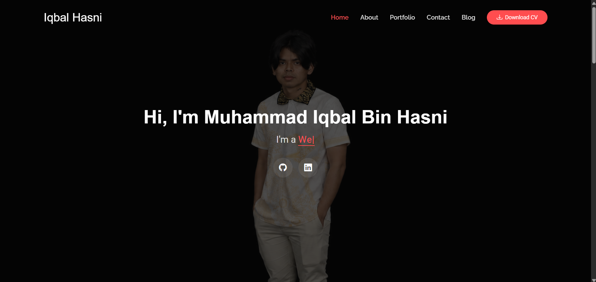

# Professional Software Developer Portfolio & Blog

[](https://iqbalhasni12.github.io/personal-portfolio-blog/)
[](https://getbootstrap.com/)
[](#technologies-used)

## 📌 Project Overview
This repository contains a premium, responsive, and highly customized personal developer portfolio combined with an integrated technical blog page. Built on top of the robust **Bootstrap v5.3 framework**, the project serves as a comprehensive digital resume and proof of work showcasing academic milestones, professional internship experience, and full-stack software architectures.

The live production application is deployed globally using automated static hosting on GitHub Pages.

🔗 **Live Production URL:** [https://iqbalhasni12.github.io/personal-portfolio-blog/](https://iqbalhasni12.github.io/personal-portfolio-blog/)

---

## 📸 Application Showcase
Below is a visual preview of the deployed production environment displaying the responsive dark-slate interface and layout integration:



---

## 🚀 Key Features

### 1. Unified Single-Page Portfolio Layout (`index.html`)
* **Dynamic Typewriter Presentation:** Leverages an advanced JavaScript animation engine (`typed.js`) to cleanly present shifting technical subtitles to prospective recruiters.
* **Sleek Bio-Profile Card:** Features an explicit profile image, role designation, functional operational indicators, and automated anchor action buttons.
* **Asynchronous Scroll Effects:** Incorporates the Animate On Scroll (`AOS.js`) library to execute hardware-accelerated viewport transition animations.
* **Responsive Visual Tag-Bars:** Displays core technical competencies through dynamically scaled, fluidly rendering percentage proficiency bars.

### 2. Integrated Architecture Showcase & Portfolio Grid
* **Isotope Sorting System:** Implements a reactive masonry-grid filtering engine powered by `isotope.pkgd.js` to showcase development tracks seamlessly.
* **Unified Visual Themes:** Utilizes embedded thematic asset icons (such as structural layout links for architecture and shopping interfaces for transactions) to clarify project contexts rapidly.

### 3. Deep-Theme Monochromatic Contact Section
* **Cohesive Dark-Slate Architecture:** Replaces generic white components with explicit high-contrast slate cards (`#1e2228`) to maintain visual continuity across high-resolution displays.
* **Three-Column Communication Hub:** Provides explicit access channels to the developer via email (`mailto:` protocol integration), phone (`tel:` protocol), and synchronized GitHub profile redirection.

### 4. Standalone Engineering Blog Page (`blog.html`)
* **Multi-Page Site Navigation:** Provides interactive cross-linked navigation headers for effortless transitions between static profile blocks and written technical logs.
* **Deep Architectural Summaries:** Contains structured, production-ready sample case logs detailing development lifecycles, database relational schemas, and model-view-controller (MVC) patterns.

---

## 🛠️ Technologies Used

The software stack utilizes low-overhead client-side architecture optimized for high performance and clean browser asset compilation:

* **Core Structure:** HTML5 & CSS3
* **Design Framework:** Bootstrap v5.3.8 (Mobile-first responsive grid system, container classes)
* **Typography & Iconography:** Google Fonts (Roboto & Raleway profiles), Bootstrap Icons Vector Library
* **Interaction Scripting:** Native JavaScript (ES6+), Typewriter Component Engine (`typed.umd.js`)
* **Layout Engines:** Isotope Masonry Compiler (`isotope.pkgd.min.js`), Glightbox Modals, Swiper UI

---

## 📂 Repository Structure & Organization
The code architecture is explicitly separated according to industry best practices to facilitate clean maintenance boundaries:

```bash
personal-portfolio-blog/
├── index.html               # Main production homepage asset
├── blog.html                # Multi-page blog application asset
├── 404.html                 # Fallback error page asset
├── privacy.html             # Extended boilerplate policy documentation
├── terms.html               # Extended user conditions asset
├── README.md                # Comprehensive documentation (This file)
└── assets/                  # Directory containing compiled production assets
    ├── css/                 # Main compiled styles stylesheets (main.css)
    ├── js/                  # Production scripting files (main.js)
    ├── img/                 # Image asset wrappers (profile and project images)
    └── vendor/              # Third-party vendor frameworks (Bootstrap, AOS, etc.)